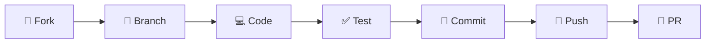

# 🛍️ Shopping Landing Page

A modern, responsive shopping landing page built to showcase products and boost conversions. 
## 🚀 Live Demo

> 🌐 [https://shopping-landing-page-green.vercel.app/](https://shopping-landing-page-green.vercel.app/)

## ✨ Features

<table>
<tr>
<td width="50%">

### 🎨 **Design & UI**
- 📱 **Fully Responsive** - Perfect on all devices
- 🌙 **Dark Mode Support** - Toggle themes seamlessly
- ✨ **Smooth Animations** - AOS scroll animations
- 🎯 **Modern Design** - Clean and professional look

</td>
<td width="50%">

### 🛒 **E-commerce Features**
- 🏷️ **Product Showcase** - Grid and featured displays
- ⭐ **Rating System** - Customer reviews and ratings
- 🛍️ **Order Management** - Interactive popup modals
- 📧 **Newsletter** - Email subscription system

</td>
</tr>
</table>

---

## 🚀 Quick Start

### Prerequisites
```bash
Node.js >= 18.0.0
npm or yarn
```

### Installation

```bash
# Clone the repository
git clone https://github.com/letera1/Shopping-Landing-Page.git

# Navigate to project directory
cd Shopping-Landing-Page

# Install dependencies
npm install

# Start development server
npm run dev
```

<div align="center">
🎉 **That's it!** Open http://localhost:5173 to see your app
</div>

---

## 🛠️ Tech Stack

<div align="center">

| Frontend | Styling | Build Tools | Libraries |
|----------|---------|-------------|-----------|
|  |  |  |  |
| React 18.2.0 | Tailwind CSS 3.4.0 | Vite 5.0.8 | AOS 2.3.4 |

</div> [2](#1-1) 

---

## 📁 Project Structure

```
🏗️ Shopping-Landing-Page/
├── 📂 src/
│   ├── 📂 components/
│   │   ├── 🧭 Navbar/           # Navigation component
│   │   ├── 🦸 Hero/             # Hero section
│   │   ├── 📦 Products/         # Product grid display
│   │   ├── ⭐ TopProducts/      # Featured products
│   │   ├── 🎯 Banner/           # Promotional banners
│   │   ├── 📧 Subscribe/        # Newsletter signup
│   │   ├── 💬 Testimonials/     # Customer reviews
│   │   ├── 🦶 Footer/           # Site footer
│   │   └── 🔔 popup/            # Order modals
│   ├── 📂 assets/
│   │   ├── 👗 women/            # Women's clothing images
│   │   ├── 👔 shirt/            # Shirt product images
│   │   └── 🌐 website/          # Website assets
│   ├── ⚛️ App.jsx               # Main application
│   └── 🚀 main.jsx              # Entry point
└── 📋 package.json              # Dependencies
```

---

## 🎯 Component Showcase

### 🛍️ Products Component [3](#1-2) 

**Features:**
- Responsive grid layout (1-5 columns)
- Star ratings and product details
- Staggered animations
- "View All" functionality

### ⭐ TopProducts Component [4](#1-3) 

**Features:**
- Premium card design
- Hover effects and animations
- Direct order integration
- Dark mode support

### 💬 Testimonials Carousel [5](#1-4) 

**Features:**
- Auto-playing carousel
- Responsive breakpoints
- Customer photos and reviews
- Smooth transitions

---

## 🎨 Customization Guide

### 🎭 Styling
```bash
# Modify Tailwind configuration
tailwind.config.js

# Custom CSS
src/index.css
```

### ✨ Animations [6](#1-5) 

```javascript
// Customize AOS settings
AOS.init({
  offset: 100,        // Trigger offset
  duration: 800,      // Animation duration
  easing: "ease-in-sine", // Easing function
  delay: 100,         // Delay before animation
});
```

### 📦 Product Data [7](#1-6) 

Update product information in:
- `src/components/Products/Products.jsx`
- `src/components/TopProducts/TopProducts.jsx`

---

## 📜 Available Scripts

| Command | Description | Usage |
|---------|-------------|-------|
| `npm run dev` | 🚀 Start development server | Development |
| `npm run build` | 🏗️ Build for production | Deployment |
| `npm run preview` | 👀 Preview production build | Testing |
| `npm run lint` | 🔍 Run ESLint | Code quality | [8](#1-7) 

---

## 🤝 Contributing

We love contributions! Here's how you can help:

<div align="center">

### 🔄 Contribution Workflow



</div>

1. **🍴 Fork** the repository
2. **🌿 Create** your feature branch (`git checkout -b feature/amazing-feature`)
3. **💻 Make** your changes
4. **✅ Test** your changes
5. **📝 Commit** your changes (`git commit -m 'Add amazing feature'`)
6. **🚀 Push** to the branch (`git push origin feature/amazing-feature`)
7. **🔄 Open** a Pull Request

---

## 📄 License

<div align="center">

This project is licensed under the **MIT License** - see the [LICENSE](LICENSE) file for details.

[](https://opensource.org/licenses/MIT)

</div>

---

## 🙏 Acknowledgments

- **React Team** for the amazing framework
- **Tailwind CSS** for the utility-first CSS framework
- **AOS Library** for smooth scroll animations
- **React Slick** for the carousel component
- **React Icons** for the beautiful icons

---

<div align="center">

### 🌟 Show your support

Give a ⭐️ if this project helped you!

Made by Letera Tujo — Developer & Designer 

</div>
```
